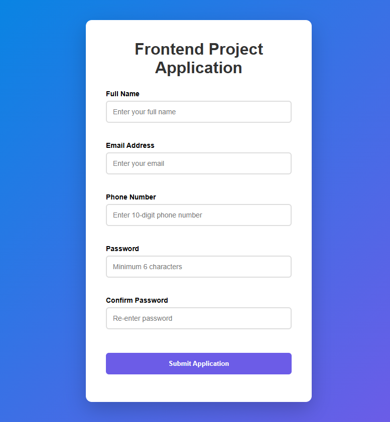
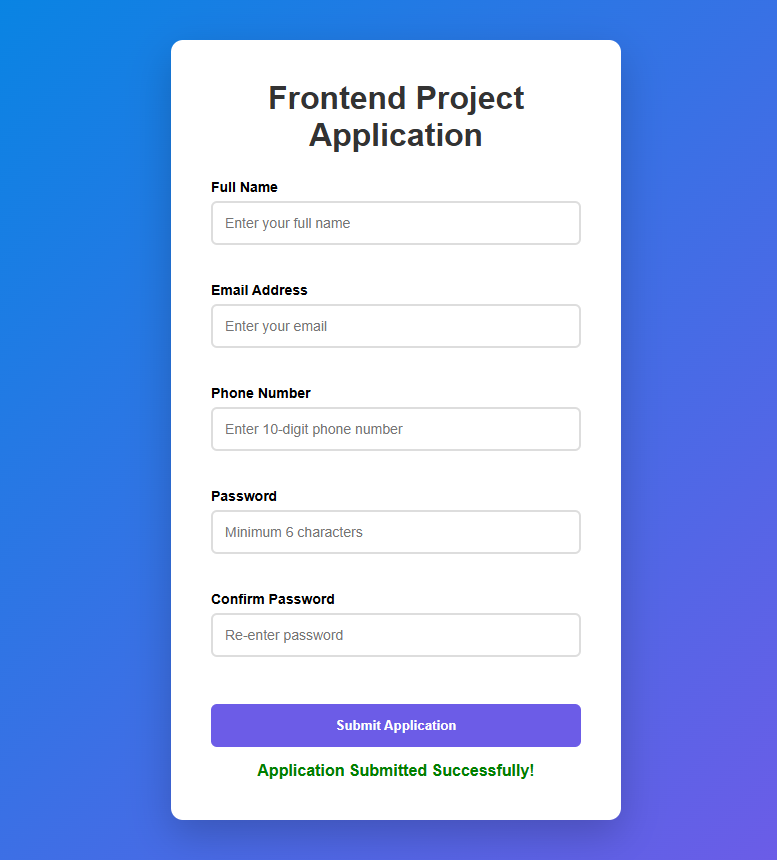

# Codveda Technologies Internship – Level 1 Task 2: Interactive Form with Validation

This project is part of the Codveda Technologies Web Development Internship.

The goal of this task was to build a fully functional interactive form using HTML, CSS, and JavaScript, including proper validation and user feedback.

---

## Project Overview

This interactive form collects user information and validates inputs before submission.

It ensures that:

- All required fields are filled
- Email format is correct
- Password meets requirements
- Errors are displayed clearly
- Success message is shown when valid

---

## Technologies Used

- HTML5
- CSS3
- JavaScript

---

## Features

- Responsive design
- Clean user interface
- Real-time validation
- Error messages
- Success message
- Professional layout

---

## Screenshots

### Full Landing Page


---

### Empty Form



---

### Form Validation Errors


---

### Successful Form Submission



---

## Project Structure

```
codveda-level1-interactive-form
│
├── index.html
├── style.css
├── script.js
│
├── screenshots
│   ├── landing-page.png
│   ├── form-empty.png
│   ├── form-error.png
│   └── form-success.png
│
└── README.md
```

---

## Learning Outcomes

Through this task, I learned:

- Form creation using HTML
- Styling forms professionally using CSS
- JavaScript form validation
- DOM manipulation
- Handling user input
- Improving user experience

---

## Author

Lehlogonolo Moseke

BSc IT (Computer Science and Informatics)

Aspiring Frontend Developer

---

## Internship Program

Codveda Technologies Web Development Internship

Level 1 – Task 2

---

## Acknowledgements

Special thanks to Codveda Technologies for providing this opportunity to enhance my web development skills.

